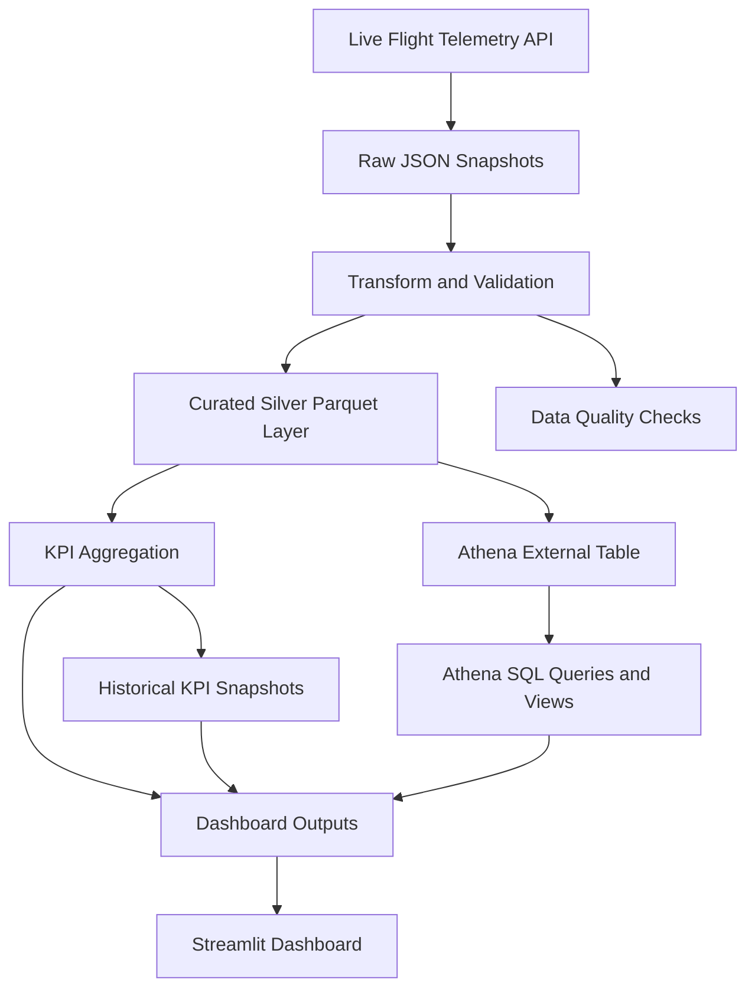

# FlightOps Data Engineering Pipeline


Production-style Data Engineering portfolio project that ingests live flight telemetry data, builds curated analytical datasets, calculates KPIs, and exposes outputs through SQL-friendly and dashboard-ready consumption layers.

The project is designed to demonstrate end-to-end pipeline thinking: ingestion, transformation, data quality, historical KPI tracking, cloud analytics, and operational reporting.

---

## Demo


---

## Business case

Operations and analytics teams need near-real-time visibility into flight activity, regional traffic patterns, aircraft movement quality, and outlier behavior.

This project simulates a realistic analytics workflow where continuously changing raw telemetry snapshots are transformed into curated analytical outputs that support:

- operational visibility
- trend tracking over time
- regional KPI analysis
- anomaly and outlier inspection
- SQL-based exploration in Athena
- dashboard-based portfolio demonstration

---

## What this project demonstrates

- modular Python package structure under `src/`
- raw to curated transformation flow
- Parquet-based analytical output layer
- KPI generation with historical tracking
- dashboard-ready reporting
- Athena-ready SQL analytics
- local-to-cloud DE workflow design
- logging, testing, and CI integration

---

## Architecture



---

## Repository structure

```text
.
├── assets/demo/            # demo visuals
├── athena/                 # Athena SQL queries
├── data/
│   ├── raw/                # raw JSON snapshots
│   ├── silver/             # curated Parquet outputs
│   └── reports/            # KPI and analytical reports
├── logs/                   # run logs
├── scripts/                # pipeline runner scripts
├── src/flightops/          # main package
├── tests/                  # pytest test suite
├── dashboard.py            # Streamlit dashboard entrypoint
├── pyproject.toml
└── README.md
```

---

## Tech stack

- Python
- Pandas
- PyArrow
- Requests
- Streamlit
- Pytest
- Ruff
- GitHub Actions
- Amazon S3
- Amazon Athena

---

## Pipeline flow

1. Fetch live flight state snapshots from the source API
2. Persist raw timestamped JSON files
3. Transform raw telemetry into curated Parquet outputs
4. Apply basic data quality rules
5. Calculate KPI summaries
6. Persist latest KPI outputs and historical KPI snapshots
7. Query curated data through Athena SQL
8. Surface results in the dashboard

---

## Outputs

The pipeline produces artifacts such as:

- raw flight state snapshots in JSON
- curated silver-layer Parquet datasets
- latest KPI report outputs
- region KPI summaries
- Athena-ready analytical data
- dashboard-ready outputs
- execution logs

### Example KPI output

```json
{
  "run_id": "20260310_100846_global",
  "aircraft_total": 14872,
  "aircraft_with_position": 14211,
  "aircraft_on_ground": 3189,
  "aircraft_in_air": 11022,
  "avg_velocity": 221.4,
  "max_velocity": 287.9,
  "dq_success_rate": 0.982
}
```

### Example regional KPI output

```json
{
  "region": "Europe",
  "aircraft_total": 4211,
  "avg_velocity": 205.7,
  "on_ground_ratio": 0.18,
  "dq_success_rate": 0.989
}
```

---

## Data quality

Basic data quality rules are applied during transformation, for example:

- valid latitude and longitude ranges
- non-negative velocity values
- controlled handling of null optional fields
- consistent analytical typing for curated outputs

Each run can be evaluated for data quality success rate, making the project more realistic than a simple ingestion-only demo.

---

## Athena analytics

The repository includes Athena SQL examples such as:

- region-level KPI aggregation
- top corridors analysis
- speed outlier inspection

This helps position the project as more than a Python ETL demo: it also shows downstream analytical consumption design.

---

## Quickstart

Create and activate a virtual environment:

```bash
python3 -m venv .venv
source .venv/bin/activate
python -m pip install --upgrade pip
pip install -e '.[dev]'
```

Run tests:

```bash
pytest
```

Lint the project:

```bash
ruff check .
```

Run the full pipeline:

```bash
./scripts/run_all.sh
```

Start the dashboard:

```bash
streamlit run dashboard.py
```

---

## Why this is portfolio-relevant

This repository is positioned as a junior-to-medior Data Engineering portfolio project.

It highlights skills that hiring managers and freelance clients can verify quickly:

- ingestion design
- curated data modeling
- analytics-oriented storage choices
- KPI reporting
- SQL consumption layer awareness
- cloud analytics thinking
- maintainability and reproducibility

---

## Current limitations

- dependent on external telemetry source availability
- local orchestration only
- lightweight CI baseline
- no warehouse orchestration framework yet

These are deliberate scope decisions to keep the project focused, portable, and easy to review.

---

## Possible next improvements

- stronger schema validation
- Docker packaging
- richer dashboard storytelling
- scheduled orchestration
- alerting on KPI anomalies

---

## License

MIT License

---

## 🔄 Pipeline Overview

This project simulates a real-time flight data pipeline:

1. **Ingestion**
   - Fetch raw flight states from API → `data/raw/`

2. **Transformation**
   - Normalize schema
   - Clean numeric fields
   - Apply data quality rules (DQ flags)

3. **Data Quality**
   - Position validation
   - Velocity sanity checks
   - Combined DQ score

4. **Output**
   - Silver layer → `data/silver/*.parquet`
   - KPI reports → `data/reports/`

5. **Analytics**
   - KPI summary
   - Region-based aggregation
   - Dashboard visualization

